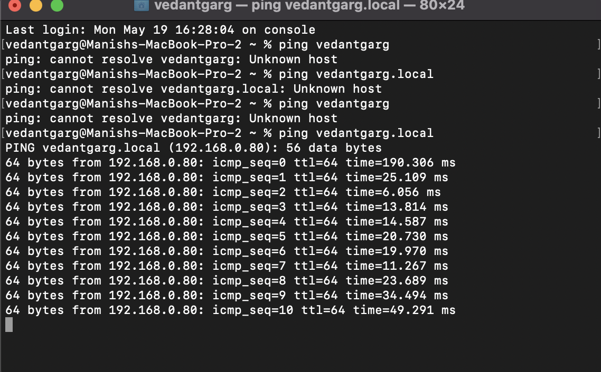
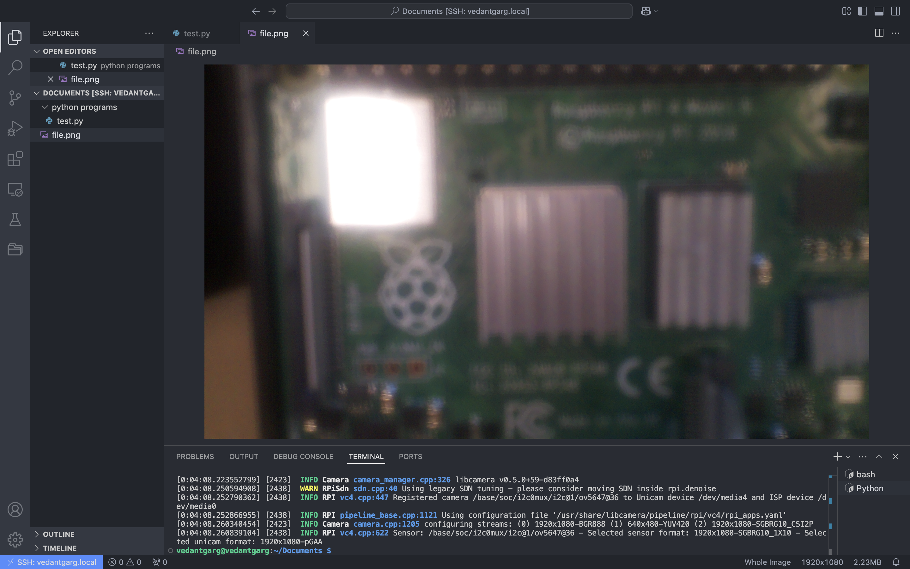
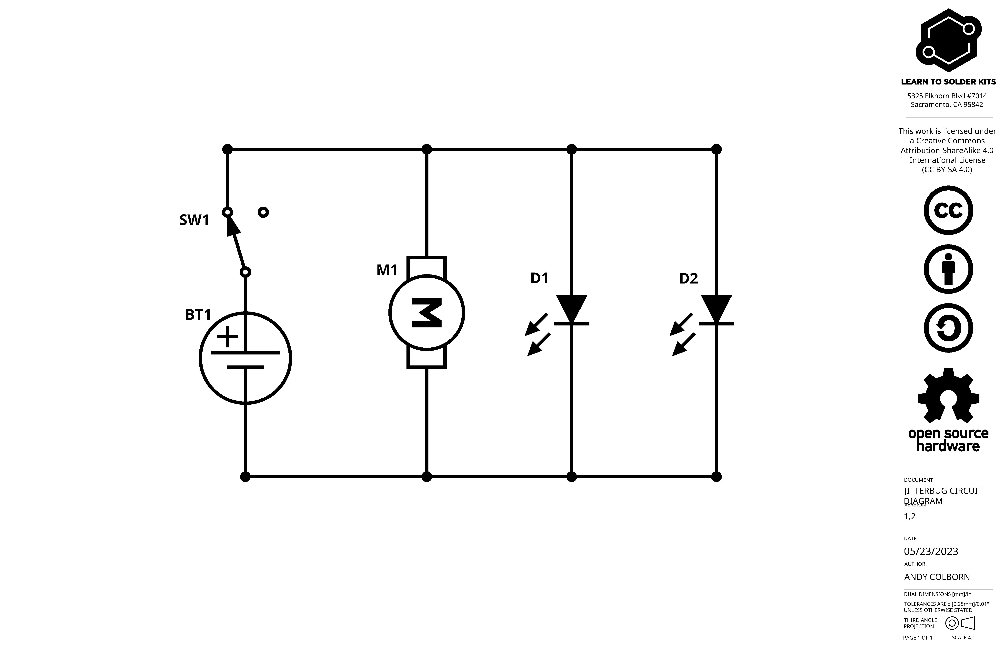

# Ball Tracking Robot
Hello! I'm Vedant from Adrian C. Wilcox High School. My projet is a litter cleaning robot that's designed to clean trash off the sides of streets. It's built with a Raspberry Pi, various sensors, and uses Computer Vision to detect various litter pieces apart.


| **Engineer** | **School** | **Interests** | **Grade** |
|:--:|:--:|:--:|:--:|
| Vedant G. | Adrian C. Wilcox High School | Mechanical Engineering/Robotics | Incoming Senior


# Milestone 2
<iframe width="966" height="543" src="https://www.youtube.com/embed/tVyszGtNbkA?list=PLe-u_DjFx7eui8dmPGji-0-slT8KydYv_" title="Vedant G. Milestone 2" frameborder="0" allow="accelerometer; autoplay; clipboard-write; encrypted-media; gyroscope; picture-in-picture; web-share" referrerpolicy="strict-origin-when-cross-origin" allowfullscreen></iframe>

My second milestone was assembling the full base chassis for the ball tracking robot and getting all the sensors to work in software. Before this point, I'd only programmed Arduino microcontrollers and not Raspberry Pi's. However, since the Pi supports Python, I was able to write code without having too much difficulty with syntax. However, it was challenging debugging the code when it didn't work, especially the camera code. Furthermore, I had to debug issues with my ultrasonic sensor and discovered that my voltage divider circuit was incorrect, so fixing this sensor was another minor challenge. The main challenge was probably wire management, as organizing dozens of jumper cables a well as delecately-soldered wires on the motors is inherently difficult. However, I plan to use 3D-printed wire-management sleeves/routes to organize the wires during my modification milestones, when I move all the parts from the base chassis to my custom bot chassis. I also look forward to finishing my OpenCV pipeline so the robot is able to detect the red ball.

#### Parts Used:
Raspberry Pi 4, TT motors, rubber wheels, chassis, breadboard, ultrasonic sensor, Arducam web camera, L298 motor driver

#### Software/Tools Used:
VSCode, Tiger VNCViewer, VSCode (SSH), RPi OS (Linux)

#### How it Works:
In order to properly connect everything to the Raspberry Pi, I made sure to write down my pin mapping for GPIO pins and their respective ports. Unlike the Arduinos I was used to working with, many GPIO pins had alternate purposes, were unlabelled, and also featured multiple 5V and GND pins. Thus, I had to be careful with my connections to ensure I was using the right pins for the right purposes. The webcam uses a wire strip that's connected to the camera port on the RPi, which makes it easy to interface with. I was also used to not requiring a voltage divider to connect the ultrasonic sensor, since the Arduino UNO board that I use can handle 5V power. However, I needed to learn about voltage dividers and create the simple circuit to supply the proper voltage to the ultrasonic sensor (3K ohm resistance to drop 5V down to 3.3V). 

#### Challenges:
The main challenges during this stage were wire management and getting the webcamera and OpenCV to work properly. 

# Milestone 1
<iframe width="966" height="543" src="https://www.youtube.com/embed/7jXYeCsxyJg?list=PLe-u_DjFx7eui8dmPGji-0-slT8KydYv_" title="Vedant G. Milestone 1" frameborder="0" allow="accelerometer; autoplay; clipboard-write; encrypted-media; gyroscope; picture-in-picture; web-share" referrerpolicy="strict-origin-when-cross-origin" allowfullscreen></iframe>

My first milestone was setting up the Raspberry Pi as well as the web camera inferface for OpenCV. Since it was my first time setting up a Raspberry Pi, it was challenging; however, the RPi documentation was very helpful. The most difficult part of the process was likely setting up SSH and ensuring that it works in VS Code. I had the advantage of working with a Mac, which has SSH installed by default (whereas it would have been more complicated on Windows). Howevever, port #22 was blocked on the wifi I was connected to, so I had to fiddle with the settings and change the port to 17872 instead, and I also had to sort out some difficulties with the hostname not resolving. It was definitely satifsfying getting the Raspberry Pi to function, and I look especially look forward to using OpenCV. It was also nice that the webcam worked right off the bat, so I could write a short testing program and take a few pictures with the webcam.

#### Parts: 
Raspberry Pi 4, Arducam Web Camera

#### Software/Tools Used: 
Raspberry Pi Imager, VS Code, RPi OS (Linux), SSH (through VS Code), VNC (Through Tiger VNCViewer)

#### How it works: 
In order to connect to the Raspberry Pi, I had to use use a method called Secure Shell, or SSH. Both the Raspberry Pi and my laptop have their own IP addresses, ports, and MAC addresses. When the computer initiates a request to connect to the Raspberry Pi on port 17872, the computer and RPi negotiate a secure, encrypted connection.

For the webcam module, it uses a wire strip to connect to the Raspberry Pi and it communicates using the PiCamera2 Python library as well as the libcamera module. By creating some basic Python code using PiCamera2, I was able to capture photos such as the one below:

I also made my own case for the RPi's Webcam and 3D printed it to ensure easy mounting later on. 

### Challenges:
The main challenge with the setup process for the Raspberry Pi setup was setting up the network connections and ensuring SSH/VNC worked well. 


<!-- ##################################################################################### -->

# Starter Project
<iframe width="966" height="543" src="https://www.youtube.com/embed/KB4aGFUIgF0?list=PLe-u_DjFx7eui8dmPGji-0-slT8KydYv_" title="Vedant G. Starter Project" frameborder="0" allow="accelerometer; autoplay; clipboard-write; encrypted-media; gyroscope; picture-in-picture; web-share" referrerpolicy="strict-origin-when-cross-origin" allowfullscreen></iframe>

My starter project was about my starter project, the jitterbug. It was good practice for soldering skills. 
#### Parts: 
JitterBug PCB, Coin Cell Battery, Red LEDs, ERM Vibration Motor, Slide Switch, Tinned Copper Wire

#### How it works: 
The circuit is powered by the small coin cell battery in the center. It conducts electricity into a metal battery holder, which powers the vibration motor and LED. A switch in the middle of the jitterbug allows current through the circuit if turned on. There are also some metal wires that act as legs for the jitterbug. 

#### Circuit Diagram:

Shown above is the circuit diagram for this starter project. As illustrated, there is a series of parallel connections all powered by the cell battery. 

### Challenges:
The main goal of this project was to practice soldering small wires; the hardest soldering joint was probably the wires of the cell battery, as the joint was miniscule and I risked burning the rubber around the extremely thin wire.

### What I learned:
By viewing and analyzing the circuit diagram, I learned abouut circuit analysis and diagramming. This project was also a great refresher on soldering techniques and safety.

<!--

  
# Final Milestone

**Don't forget to replace the text below with the embedding for your milestone video. Go to Youtube, click Share -> Embed, and copy and paste the code to replace what's below.**

<iframe width="560" height="315" src="https://www.youtube.com/embed/F7M7imOVGug" title="YouTube video player" frameborder="0" allow="accelerometer; autoplay; clipboard-write; encrypted-media; gyroscope; picture-in-picture; web-share" allowfullscreen></iframe>

For your final milestone, explain the outcome of your project. Key details to include are:
- What you've accomplished since your previous milestone
- What your biggest challenges and triumphs were at BSE
- A summary of key topics you learned about
- What you hope to learn in the future after everything you've learned at BSE


# Second Milestone

**Don't forget to replace the text below with the embedding for your milestone video. Go to Youtube, click Share -> Embed, and copy and paste the code to replace what's below.**

<iframe width="560" height="315" src="https://www.youtube.com/embed/y3VAmNlER5Y" title="YouTube video player" frameborder="0" allow="accelerometer; autoplay; clipboard-write; encrypted-media; gyroscope; picture-in-picture; web-share" allowfullscreen></iframe>

For your second milestone, explain what you've worked on since your previous milestone. You can highlight:
- Technical details of what you've accomplished and how they contribute to the final goal
- What has been surprising about the project so far
- Previous challenges you faced that you overcame
- What needs to be completed before your final milestone 

# Final Milestone

**Don't forget to replace the text below with the embedding for your milestone video. Go to Youtube, click Share -> Embed, and copy and paste the code to replace what's below.**

<iframe width="560" height="315" src="https://www.youtube.com/embed/CaCazFBhYKs" title="YouTube video player" frameborder="0" allow="accelerometer; autoplay; clipboard-write; encrypted-media; gyroscope; picture-in-picture; web-share" allowfullscreen></iframe>

For your final milestone, explain the outcome of your project. Key details to include are:
- What you've accomplished since your previous milestone
- What your biggest challenges and triumphs were at BSE
- A summary of key topics you learned about
- What you hope to learn in the future after everything you've learned at BSE

# Schematics 
Here's where you'll put images of your schematics. [Tinkercad](https://www.tinkercad.com/blog/official-guide-to-tinkercad-circuits) and [Fritzing](https://fritzing.org/learning/) are both great resoruces to create professional schematic diagrams, though BSE recommends Tinkercad becuase it can be done easily and for free in the browser. 

# Code
Here's where you'll put your code. The syntax below places it into a block of code. Follow the guide [here]([url](https://www.markdownguide.org/extended-syntax/)) to learn how to customize it to your project needs. 

```c++
void setup() {
  // put your setup code here, to run once:
  Serial.begin(9600);
  Serial.println("Hello World!");
}

void loop() {
  // put your main code here, to run repeatedly:

}
```

# Bill of Materials
Here's where you'll list the parts in your project. To add more rows, just copy and paste the example rows below.
Don't forget to place the link of where to buy each component inside the quotation marks in the corresponding row after href =. Follow the guide [here]([url](https://www.markdownguide.org/extended-syntax/)) to learn how to customize this to your project needs. 

| **Part** | **Note** | **Price** | **Link** |
|:--:|:--:|:--:|:--:|
| Item Name | What the item is used for | $Price | <a href="https://www.amazon.com/Arduino-A000066-ARDUINO-UNO-R3/dp/B008GRTSV6/"> Link </a> |
| Item Name | What the item is used for | $Price | <a href="https://www.amazon.com/Arduino-A000066-ARDUINO-UNO-R3/dp/B008GRTSV6/"> Link </a> |
| Item Name | What the item is used for | $Price | <a href="https://www.amazon.com/Arduino-A000066-ARDUINO-UNO-R3/dp/B008GRTSV6/"> Link </a> |

# Other Resources/Examples
One of the best parts about Github is that you can view how other people set up their own work. Here are some past BSE portfolios that are awesome examples. You can view how they set up their portfolio, and you can view their index.md files to understand how they implemented different portfolio components.
- [Example 1](https://trashytuber.github.io/YimingJiaBlueStamp/)
- [Example 2](https://sviatil0.github.io/Sviatoslav_BSE/)
- [Example 3](https://arneshkumar.github.io/arneshbluestamp/)

To watch the BSE tutorial on how to create a portfolio, click here. 
-->
