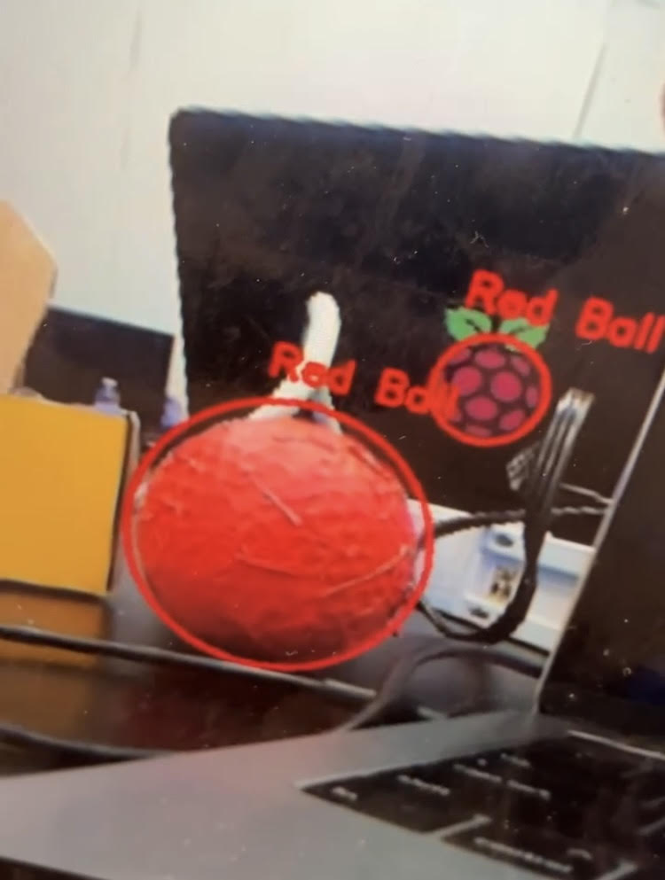

# LitterBot
Hello! I'm Vedant from Adrian C. Wilcox High School. My projet is a litter cleaning robot that's designed to clean trash off the sides of streets. It's built with a Raspberry Pi, an ultrasonic sensor, webcam, IMU module, and uses Computer Vision to detect various litter pieces apart.


| **Engineer** | **School** | **Interests** | **Grade** |
|:--:|:--:|:--:|:--:|
| Vedant G. | Adrian C. Wilcox High School | Mechanical Engineering/Robotics | Incoming Senior


# Modifications:
  The modifications were definitely took the most time, but it was very rewarding. I completely switched the drivetrain, OpenCV model, and rehauled the hardware and wiring to make the bot look much cleaner. 

#### Chassis and Drivetrain:
  I started with a base tank chassis and assembled it from scratch, ensuring that I labelled all motors and motor wires (which made the programming process much easier later). I chose a tank chassis because in the real world, it would have real applications since the bot would need to cross rough terrain on roads. This chassis was also much sturdier, as it featured an aluminum frame. It also looked much cooler than the plastic chassis. This chassis actually inspired another student who was doing the ball-tracking robot to switch over to the tank tracks as well.

#### OpenCV Pipeline Rework:
  One of the main modifications of this part of my project was getting the model to detect pieces of trash instead of the bright red ball. This required a complete overhaul of the OpenCV model. Instead of applying a color mask and eroding an image, I used MobileSSD's model trained on a variety of different objects to recognize and detect plastic bottles and other pieces of trash. Even though MobileNetSSD isn’t perfect for close-range detection, it gave me a much better baseline for consistent results in varying lighting and angles. 
  Furthermore, I also modified the distance sensing. My goal with this overhaul was also to simplify my project as much as I could, so I found a way to remove the ultrasonic sensor by detecting distance based on focal length and an object's pixel distance from the camera. This meant that there was no need for a voltage divider circuit, and it removed lots of wiring clutter and power load on the batteries/Pi.
  The model also drew dynamic bounding boxes around pieces of trash, which helped me later on with programming, as I could reference (x,y) coordinates on these bounding boxes to perform operations such as distance calculations and automatic claw control.
  

```python
picam2 = Picamera2()
video_config = picam2.create_video_configuration(main={"size": (320, 240), "format": "RGB888"})
print("video initialized")
picam2.configure(video_config)
picam2.start()
time.sleep(1)

output_frame = None
frame_lock = threading.Lock()

# Load MobileNetSSD model
net = cv2.dnn.readNetFromCaffe('MobileNetSSD_deploy.prototxt', 'MobileNetSSD_deploy.caffemodel')
print("model loaded")
net.setPreferableBackend(cv2.dnn.DNN_BACKEND_DEFAULT)
net.setPreferableTarget(cv2.dnn.DNN_TARGET_CPU)

classes = ["background", "aeroplane", "bicycle", "bird", "boat",
           "bottle", "bus", "car", "cat", "chair", "cow", "diningtable",
           "dog", "horse", "motorbike", "person", "pottedplant",
           "sheep", "sofa", "train", "tvmonitor"]

trash_classes = {"bottle"}
detected_trash_center = [0, 0]
print("model initialized")


set_servo("half")
def detect_trash(frame):
    global detected_trash_center, estimated_distance_cm

    h, w = frame.shape[:2]

    blob = cv2.dnn.blobFromImage(cv2.resize(frame, (400, 400)), 0.007843, (400, 400), 127.5)
    net.setInput(blob)
    detections = net.forward()

    detected_trash_center = [0, 0]
    estimated_distance_cm = float('inf')

    for i in range(detections.shape[2]):
        confidence = detections[0, 0, i, 2]
        if confidence > 0.3:
            idx = int(detections[0, 0, i, 1])
            label = classes[idx]
            if label in trash_classes:
                box = detections[0, 0, i, 3:7] * [w, h, w, h]
                (startX, startY, endX, endY) = box.astype("int")
                centerX = (startX + endX) // 2
                centerY = (startY + endY) // 2

                box_width = endX - startX  # width in pixels based on bounding box

                # distance estimation (focal length has to be calibrated)
                if box_width > 0:
                    estimated_distance_cm = (REAL_OBJECT_WIDTH_CM * FOCAL_LENGTH) / box_width

                detected_trash_center = [centerX, centerY]

                # annotate Frame
                cv2.rectangle(frame, (startX, startY), (endX, endY), (0, 255, 0), 2)
                cv2.putText(frame, f"{label}: {confidence:.2f}", (startX, startY - 10),
                            cv2.FONT_HERSHEY_SIMPLEX, 0.5, (0, 255, 0), 2)
                cv2.putText(frame, f"Dist: {estimated_distance_cm:.1f} cm", (centerX, centerY),
                            cv2.FONT_HERSHEY_SIMPLEX, 0.5, (0, 0, 255), 2)

                break  # only process first detected object

    return frame


def camera_loop():
    global output_frame
    frame_count = 0
    while True:
        frame = picam2.capture_array()
        frame = cv2.rotate(frame, cv2.ROTATE_180)

        if frame_count % 2 == 0:  # process every other frame
            frame = detect_trash(frame)

        with frame_lock:
            output_frame = frame

        frame_count += 1
        time.sleep(1.0 / FPS)


def control_loop():
    last_detected = False
    try:
        while True:
            if detected_trash_center[0] != 0:
                if not last_detected:
                    print("✅ Trash detected.", flush=True)
                    last_detected = True
                track_center()
            else:
                if last_detected:
                    print("❌ Trash not detected.", flush=True)
                    last_detected = False
            time.sleep(1.0 / FPS)
    except KeyboardInterrupt:
        pass
```

#### Claw Subsystem
  One of my favorite modifications to this project was adding on the claw to pick up the pieces of trash and move them around. I reiterated the design for the claw. Originally, it included three different servos. However, this would have been too much power draw and the connetions started to come loose. I simplified this to a design that only required two servos, and the claw could rotate on two differenta axes to pick up bottles and pieces of trash on many different orientations. 
  Writing the code for the claw was definitely difficult, as I had to fine-tune the servo values for the claw and ensure it worked every time. I did not have any encoders on the servos, which made it more difficult. I used pulse-width modulation (PWM) to avoid jitter and misaligntment. After several rounds of trial and error, I calibrated the servo's open, half-open, and closed positions based on durty cycle percentages. I also tuned the second servo, which acteda s a sort of wrist for the claw. I also introduced a contro llogic system that prevented redundant commands. For example, once the claw closed on a detected object, I locked the servo in place and restricted the program from sending repeated "close" signals, which would otherwise cause unecessary strain and power consumption. 
  Mechanically, mounting the claw presented its own challenges. I had to ensure that the servo housing was rigidly secured to the chassis, yet isolated enough to avoid absorbing vibrations from the motors. I also accounted for wire routing, giving the servo cable enough slack to move with the gripper arm without tugging on the connection point.

```python
import RPi.GPIO as GPIO
from time import sleep

claw = 14
wrist = 18
OFFSET = 2.5
GPIO.setmode(GPIO.BCM)
GPIO.setup(claw, GPIO.OUT)
GPIO.setup(wrist, GPIO.OUT)

claw_pwm = GPIO.PWM(claw, 50)  # 50Hz PWM frequency
claw_pwm.start(0)

wrist_pwm = GPIO.PWM(wrist, 50)
wrist_pwm.start(0)


def set_angle(angle, servo="claw"):
    duty = angle / 18 + OFFSET  # maps 0–180 degrees to ~2.5%–12.5% duty cycle
    if (servo=="claw"):
        claw_pwm.ChangeDutyCycle(duty)
        sleep(1)
        claw_pwm.ChangeDutyCycle(0)
    else:
        wrist_pwm.ChangeDutyCycle(duty)
        sleep(1)
        wrist_pwm.ChangeDutyCycle(0)
      # prevent servo jitter

# kind of an enum; makes it easier to map servo positions to numbers for tuning
# values based on trial and error
class ServoPositions():
    CLOSE = 55
    HALF = 30
    OPEN = 15
    TOP = 30
    BOTTOM = 120

# main function to set position
def set_servo(position="half"):
    if (position == "close"):
        set_angle(ServoPositions.CLOSE, "claw")
    elif (position == "complete_open"):
        set_angle(ServoPositions.OPEN, "claw")
    elif (position == "half"):
        set_angle(ServoPositions.HALF, "claw")
    elif (position == "top"):
        set_angle(ServoPositions.TOP, "wrist")
    else:
        set_angle(ServoPositions.BOTTOM, "wrist")
```


#### Hardware and Cable Management
  One of the most time-consuming and often overlooked parts of this project was the wire management and hardware design to organize the robot. In my intial build, the wiring was a tangled mess, which caused constant electrical issues and unintended shorts. Wires would also come loose very easily or snag on a wheel, which made debugging very tedious. To address this, I rewired the entire system when mounting it on the tank chassis, and custom cadded wire guides and platforms for every part. I also labelled the wires to make debugging much faster. Motor wires were directly soldered on, and I used wire wraps and tape to group together my wires so they wouldn't tangle. By the end of this overhaul, the robot looked cleaner and also was significantly easier to troubleshoot. I could eliminate random shorts and greatly reduced the risk of disconnects.

 
 <br>
<em>An image of the OpenCV model working in real-time. The size of the circle adjusts to the size of the red ball.</em>

# Milestone 3
<iframe width="966" height="543" src="https://www.youtube.com/embed/zQjKnPrG0UA?list=PLe-u_DjFx7eui8dmPGji-0-slT8KydYv_" title="Vedant G. Milestone 3" frameborder="0" allow="accelerometer; autoplay; clipboard-write; encrypted-media; gyroscope; picture-in-picture; web-share" referrerpolicy="strict-origin-when-cross-origin" allowfullscreen></iframe>

  My third milestone was probably the most challenging up to this point; it was to finish the actual software for the bot and get it to track the ball on-screen with OpenCV and translate that into actual movement on the bot. However, I was motivated to finish since I was looking forward to working on my modifications, which are the bulk of my project. Since I had some previous experience with OpenCV and already had some boilerplate code from Milestone 2, it made the process a bit easier. However, I had to fine-tunbe tons of different variables and optimize many features to get the bot to track the ball real-time instead of slightly delayed. I also had some debugging to do for the motor wiring (since I did not label my motor wires); for the future moving of all the parts to the tank chassis, I will ensure that I label and organize my wires to expedite this process. 

#### Software/Tools Used:
VSCode, Tiger VNCViewer, VSCode (SSH), RPi OS (Linux)

#### How it Works:
  The OpenCV pipeline works by recognizing an object primarily based on color; in this case, a red colored ball. I originally had a pipeline that also detected the shape of the ball, but it made the bot lag slighlty and therefore turning was delayed, which caused all sorts of errors in movement. When the program detects a red object, it draws a bounding box around the object at the x and y coordinates of the object, where the bottom left corner of the box is the origin point. Since my bot needs to track the center of the ball and not the corner, I did some simple arithmetic: `(x + width) / 2` for the x-coordinate, and `(y + height) / 2`, where x is the origin point's x and y is the origin point's y. I stored these coordinates in a variable called `ball_pos`, which was updated every 24 frames (a value I precisely tuned in order to get the bot to move in real-time without much lag). Based on this, I calculated the offset of the ball from the center line (which was just the width of the entire window / 2). The offset from the center line is stored in a variable called `delta`; if delta is negative, the ball is a bit to the left of the center. If it is positive, the ball is too much to the right. The bot turns left or right to center the ball within 50 pixels of the center line. Once the ball is centered, the bot moves forward until the ultrasonic sensor detects the ball and the bot stops. 
  To organize the code, I've stored all motor-related code in it's own file, `motorcode.py`, and just import everything from that file into every other python file I need to use motors in. This way, whenever I change a motor's port or want to adjust it's speed, I can simply update one file to update everything else. 

#### Challenges:
  Throughout this process, I faced lots of difficult challenges, mostly with getting the OpenCV pipeline to work correctly and tuning the bot's movement. The first problem I faced was with running multiple loops at the same time; in order to increase efficiency, I wanted to run a loop for motor control and OpenCV at the same time; however, the async library that I was using was too slow and caused delays. I switched to another implementation:

```python
if __name__ == '__main__':
    t1 = threading.Thread(target=camera_loop)
    t1.daemon = True
    t1.start()
   t2 = threading.Thread(target=control_loop)
    t2.daemon = True
    t2.start()
```
With this implentation, I could use multithreading to run multiple while loops at the same time with Daemon instead, which is built into Python and worked much better. However, the loop was still too slow. I decided to look into adjusting the FPS; I intentionally delayed the loop by 0.024 seconds, which translated to 24 FPS; a number based on tons of trial-and-error tuning. I also used a Gaussian blur and mask in order to erode the quality of the image and make the model faster. My other main challenge was that the bot was overturning; wen it detected that the ball was off-centered, it would turn left or right. However, it would turn so quickly that the ball would leave the frame, and it would get stuck in a loop of turning in circles. To fix this, I implemented motor PWM control to properly control motor speed:

```python
def init():
    global left_pwm, right_pwm
    GPIO.setmode(GPIO.BCM)
    GPIO.setwarnings(False)
    GPIO.setup([IN1, IN2, IN3, IN4], GPIO.OUT)
    if left_pwm is None:
        left_pwm = PWMOutputDevice(ENA)
    if right_pwm is None:
        right_pwm = PWMOutputDevice(ENB)
    left_pwm.value = 1.0
    right_pwm.value = 1.0
def set_speed(left=1.0, right=1.0):
    left_pwm.value = left
    right_pwm.value = right
```
    
This process was a bit challenging to figure out, as I hadn't used motor PWM directly before this point. However, this solution worked and the bot turned much slower, and it could efficently track the ball. 

# Milestone 2
<iframe width="966" height="543" src="https://www.youtube.com/embed/tVyszGtNbkA?list=PLe-u_DjFx7eui8dmPGji-0-slT8KydYv_" title="Vedant G. Milestone 2" frameborder="0" allow="accelerometer; autoplay; clipboard-write; encrypted-media; gyroscope; picture-in-picture; web-share" referrerpolicy="strict-origin-when-cross-origin" allowfullscreen></iframe>

  My second milestone was assembling the full base chassis for the ball tracking robot and getting all the sensors to work in software. Before this point, I'd only programmed Arduino microcontrollers and not Raspberry Pi's. However, since the Pi supports Python, I was able to write code without having too much difficulty with syntax. However, it was challenging debugging the code when it didn't work, especially the camera code. Furthermore, I had to debug issues with my ultrasonic sensor and discovered that my voltage divider circuit was incorrect, so fixing this sensor was another minor challenge. The main challenge was probably wire management, as organizing dozens of jumper cables a well as delecately-soldered wires on the motors is inherently difficult. However, I plan to use 3D-printed wire-management sleeves/routes to organize the wires during my modification milestones, when I move all the parts from the base chassis to my custom bot chassis. I also look forward to finishing my OpenCV pipeline so the robot is able to detect the red ball. Unfortunately, I still need to do some tuning to the model, since it is not as accurate as I would need just yet (as shown in the image). I also plan to expand the space on the tank chassis through 3D-printed platforms, as space on this current ball-tracking chassis was compressed and I had to carefully balance the weight.

 <br>
<em>An image of the OpenCV model working in real-time. The size of the circle adjusts to the size of the red ball.</em>
#### Parts Used:
Raspberry Pi 4, TT motors, rubber wheels, chassis, breadboard, ultrasonic sensor, Arducam web camera, L298 motor driver

#### Software/Tools Used:
VSCode, Tiger VNCViewer, VSCode (SSH), RPi OS (Linux)

#### How it Works:
  In order to properly connect everything to the Raspberry Pi, I made sure to write down my pin mapping for GPIO pins and their respective ports. Unlike the Arduinos I was used to working with, many GPIO pins had alternate purposes, were unlabelled, and also featured multiple 5V and GND pins. Thus, I had to be careful with my connections to ensure I was using the right pins for the right purposes. The webcam uses a wire strip that's connected to the camera port on the RPi, which makes it easy to interface with. I was also used to not requiring a voltage divider to connect the ultrasonic sensor, since the Arduino UNO board that I use can handle 5V power. However, I needed to learn about voltage dividers and create the simple circuit to supply the proper voltage to the ultrasonic sensor (3K ohm resistance to drop 5V down to 3.3V). 

#### Challenges:
  The main challenges during this stage were getting OpenCV to work properly and recognize the ball. Furthermore, wire management was also difficult. Before this point, I had only worked with much simpler OpenCV models, and performance optimization was not too much of a worry. However, with the limited processing power of a Raspberry Pi, I needed to ensure my code was extremely clean and optimized, which is especially hard in Python when compared to another language such as C++. However, I used Gaussian blur masks as well as limiting FPS in the browser preview of the video to ensure that the video stream was not very delayed. Furthermore, it was difficult to draw a bounding shape around the red ball; meaning that the program would dynamically adjust the size and shape of the bounding box to fit the red ball. I poured through tons of documentation online until I was able to get this working. This feature can be seen in the above image, where the smaller "red ball" it recognizes has a dynamically shaped bounding box drawn around it, and the larger red ball has a larger circle fitting it.

# Milestone 1
<iframe width="966" height="543" src="https://www.youtube.com/embed/7jXYeCsxyJg?list=PLe-u_DjFx7eui8dmPGji-0-slT8KydYv_" title="Vedant G. Milestone 1" frameborder="0" allow="accelerometer; autoplay; clipboard-write; encrypted-media; gyroscope; picture-in-picture; web-share" referrerpolicy="strict-origin-when-cross-origin" allowfullscreen></iframe>

  My first milestone was setting up the Raspberry Pi as well as the web camera inferface for OpenCV. Since it was my first time setting up a Raspberry Pi, it was challenging; however, the RPi documentation was very helpful. The most difficult part of the process was likely setting up SSH and ensuring that it works in VS Code. I had the advantage of working with a Mac, which has SSH installed by default (whereas it would have been more complicated on Windows). Howevever, port #22 was blocked on the wifi I was connected to, so I had to fiddle with the settings and change the port to 17872 instead, and I also had to sort out some difficulties with the hostname not resolving. It was definitely satifsfying getting the Raspberry Pi to function, and I look especially look forward to using OpenCV. It was also nice that the webcam worked right off the bat, so I could write a short testing program and take a few pictures with the webcam.

#### Parts: 
Raspberry Pi 4, Arducam Web Camera

#### Software/Tools Used: 
Raspberry Pi Imager, VS Code, RPi OS (Linux), SSH (through VS Code), VNC (Through Tiger VNCViewer)
 <br>
<em>A picture of the command-line output of the Pi.</em>

#### How it works: 
In order to connect to the Raspberry Pi, I had to use use a method called Secure Shell, or SSH. Both the Raspberry Pi and my laptop have their own IP addresses, ports, and MAC addresses. When the computer initiates a request to connect to the Raspberry Pi on port 17872, the computer and RPi negotiate a secure, encrypted connection.

For the webcam module, it uses a wire strip to connect to the Raspberry Pi and it communicates using the PiCamera2 Python library as well as the libcamera module. By creating some basic Python code using PiCamera2, I was able to capture photos such as the one below:
 <br>
<em>A photo taken with the PI Camera.</em>

I also made my own case for the RPi's Webcam and 3D printed it to ensure easy mounting later on. 

### Challenges:
  The main challenge with the setup process for the Raspberry Pi setup was setting up the network connections and ensuring SSH/VNC worked well. The initial set-up of a new wi-fi connection is a bit tedious, especially on a headless setup where I need to use OBS to create a new video capture device and view the Raspberry Pi from there, as well as control it with external peripherals. However, tools like TigerVNC Viewer made this process much easier after the intial connection to wi-fi, as I could simply use my built-in mouse and keyboard and view the Raspberry Pi on my laptop itself. SSH was a bit challenging to set up with VSCode initially, but the VS Code extensions made it much simpler to interface with.

# LibberBot Bill of Materials

| **Part** | **Note** | **Price** | **Link** |
|:--:|:--:|:--:|:--:|
| Raspberry Pi 4 | Main microcontroller that powers the project | $63 | <a href="https://www.amazon.com/Raspberry-Model-2019-Quad-Bluetooth/dp/B07TC2BK1X"> Link </a> |
| Tank Chassis | Drivetrain of the robot | $21 | <a href="https://www.amazon.com/Intelligent-Compatible-Bluetooth-Scientific-Competition/dp/B09VZVFL9D"> Link </a> |
| Item Name | What the item is used for | $Price | <a href="https://www.amazon.com/Arduino-A000066-ARDUINO-UNO-R3/dp/B008GRTSV6/"> Link </a> |

<!-- ##################################################################################### -->

# Starter Project
<iframe width="966" height="543" src="https://www.youtube.com/embed/KB4aGFUIgF0?list=PLe-u_DjFx7eui8dmPGji-0-slT8KydYv_" title="Vedant G. Starter Project" frameborder="0" allow="accelerometer; autoplay; clipboard-write; encrypted-media; gyroscope; picture-in-picture; web-share" referrerpolicy="strict-origin-when-cross-origin" allowfullscreen></iframe>

My starter project was about my starter project, the jitterbug. It was good practice for soldering skills. 
#### Parts: 
JitterBug PCB, Coin Cell Battery, Red LEDs, ERM Vibration Motor, Slide Switch, Tinned Copper Wire

#### How it works: 
  The circuit is powered by the small coin cell battery in the center. It conducts electricity into a metal battery holder, which powers the vibration motor and LED. A switch in the middle of the jitterbug allows current through the circuit if turned on. There are also some metal wires that act as legs for the jitterbug. 

#### Circuit Diagram:
 <br>
<em>A circuit diagram of the Jitterbug; sourced from the OnShape page for the Jitterbug.</em>

  Shown above is the circuit diagram for this starter project. As illustrated, there is a series of parallel connections all powered by the cell battery. 

### Challenges:
  The main goal of this project was to practice soldering small wires; the hardest soldering joint was probably the wires of the cell battery, as the joint was miniscule and I risked burning the rubber around the extremely thin wire. 

### What I learned:
  By viewing and analyzing the circuit diagram, I learned abouut circuit analysis and diagramming. This project was also a great refresher on soldering techniques and safety.
